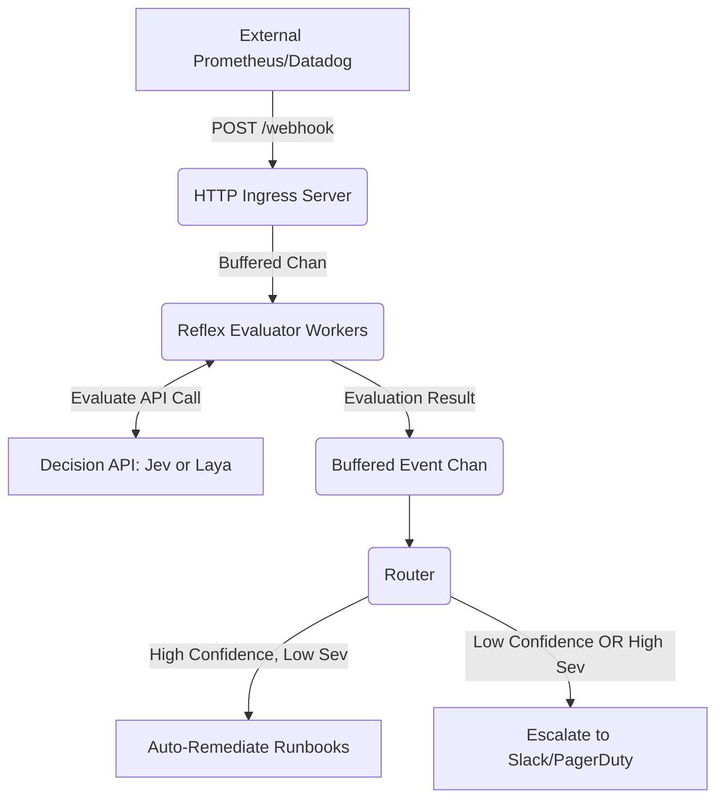

# Reflex 🚀✨

**Intelligent Observability and Remediation Proxy**

Reflex is a high-throughput Go proxy that ingests infrastructure alerts via HTTP webhooks, integrates with decision model APIs (like Jev and local Laya instances) to evaluate them concurrently, and routes them to either an auto-remediation runbook (if it's a known slay) or a human escalation queue (if it needs adult supervision).

## 🏗️ Architecture

We use standard Go concurrency (goroutines and buffered channels) to keep things completely non-blocking and prevent deadlocks during high-traffic bursts.



## 🧠 Routing Logic

### Condition A (Auto-Remediate) ✅
- `domain` is known
- `severity` < 8.0
- `auto_recoverable` > 0.60
- overall `confidence` >= 0.60

### Condition B (Human Escalation) 🚨
- `confidence` < 0.60 OR `severity` >= 8.0

## 🛠️ Demo Time!

Make sure you have [Just](https://github.com/casey/just) installed.

### Option A: Use the fully local Laya Microservice (Free Alternative)
We built a thin Python wrapper around [Laya](https://github.com/NandhaKishorM/laya) that mimics the Jev API identically, so you can test the system locally for free!

1. **Start the Laya Server** (Requires Python 3.10+)
   ```bash
   just run-laya-server
   ```
   *Note: This will download the Laya checkpoints (~400MB) on the first run.*
2. **Start the Proxy Server**
   ```bash
   just run-laya
   ```

### Option B: Use the Mock or Real Jev API
```bash
# Uses the Mock Jev Client (No API Key Required)
just run

# OR: Use the Real Jev API
JEV_API_KEY=your_actual_key just run-real
```

### 3. Blast it with Traffic

Open a **separate terminal window** and fire the load generator. This will instantly shoot 50 concurrent JSON webhook payloads at your proxy.

```bash
just load
```

Watch the terminal light up with beautiful terminal colors as the router instantly processes and routes the alerts! ✨

## 🧪 End-to-End Local Testing
Want to test the full auto-remediation pipeline with a real local Kubernetes cluster?
Check out the **[End-to-End Kubernetes Testing Guide](TESTING.md)** for detailed instructions on spinning up the cluster and verifying runbooks locally on Windows (WSL), Linux, or macOS.
